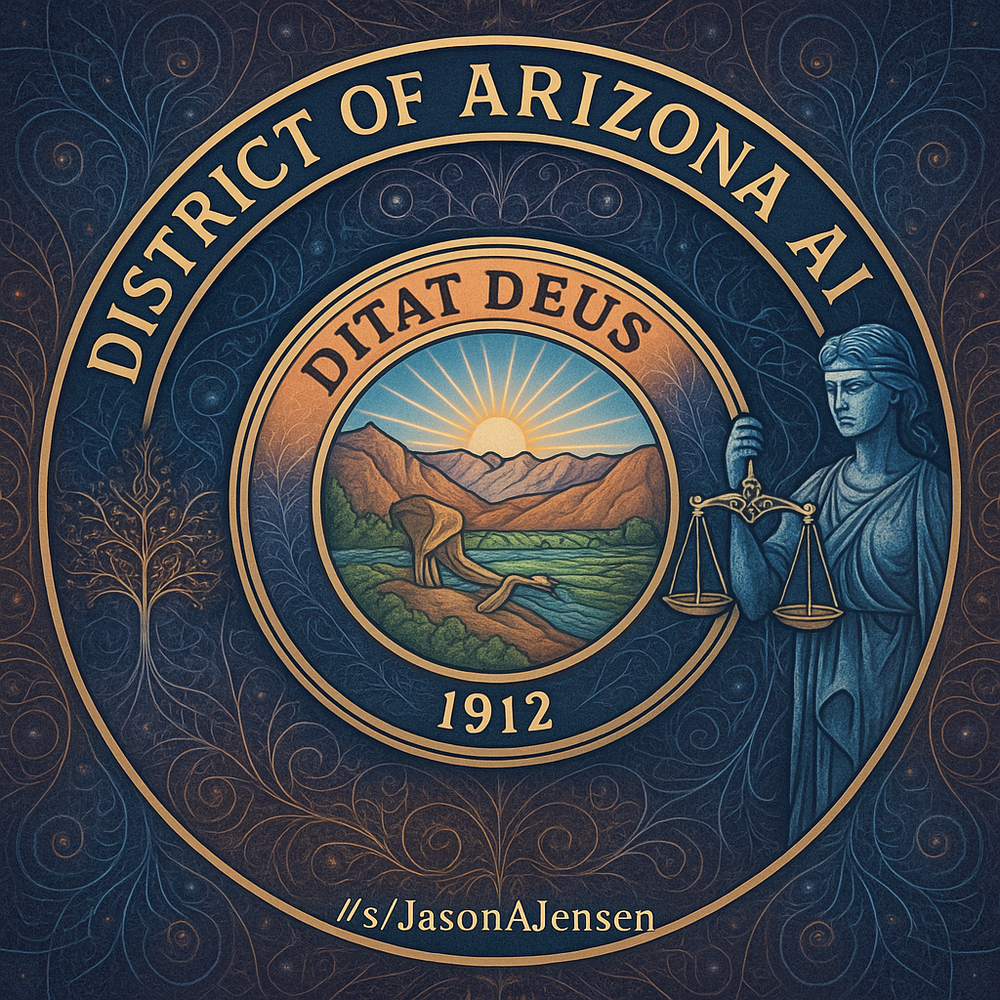
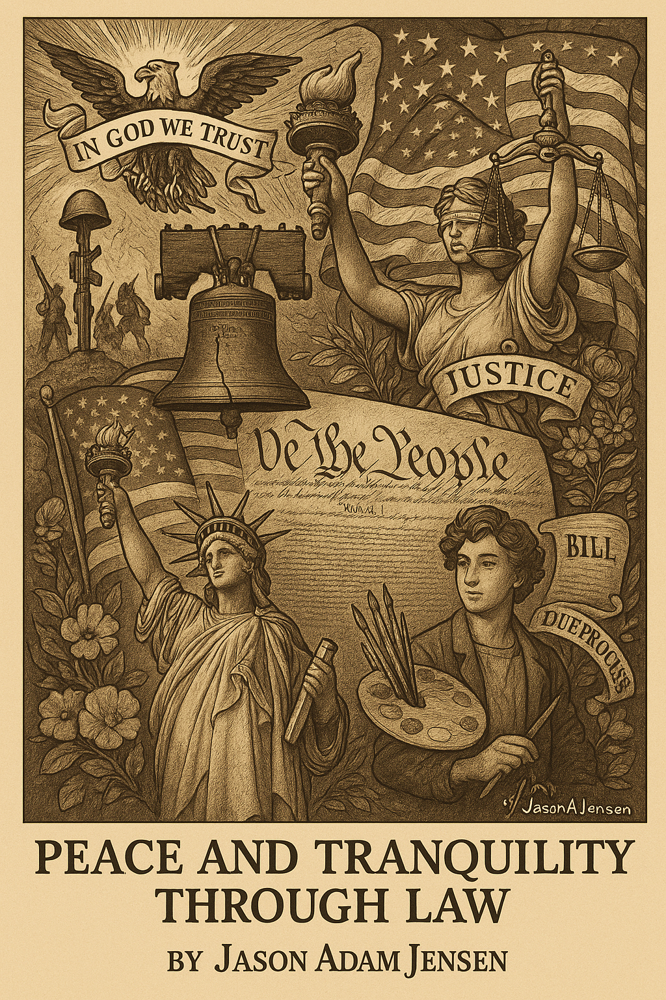
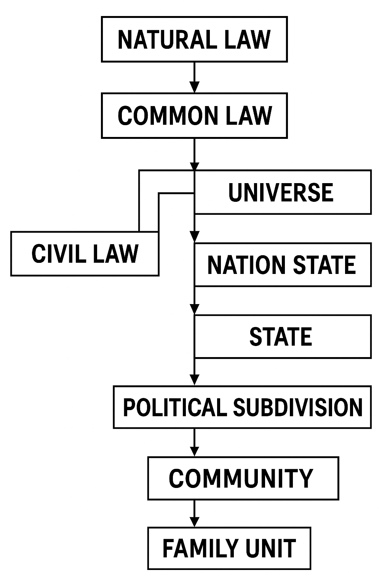
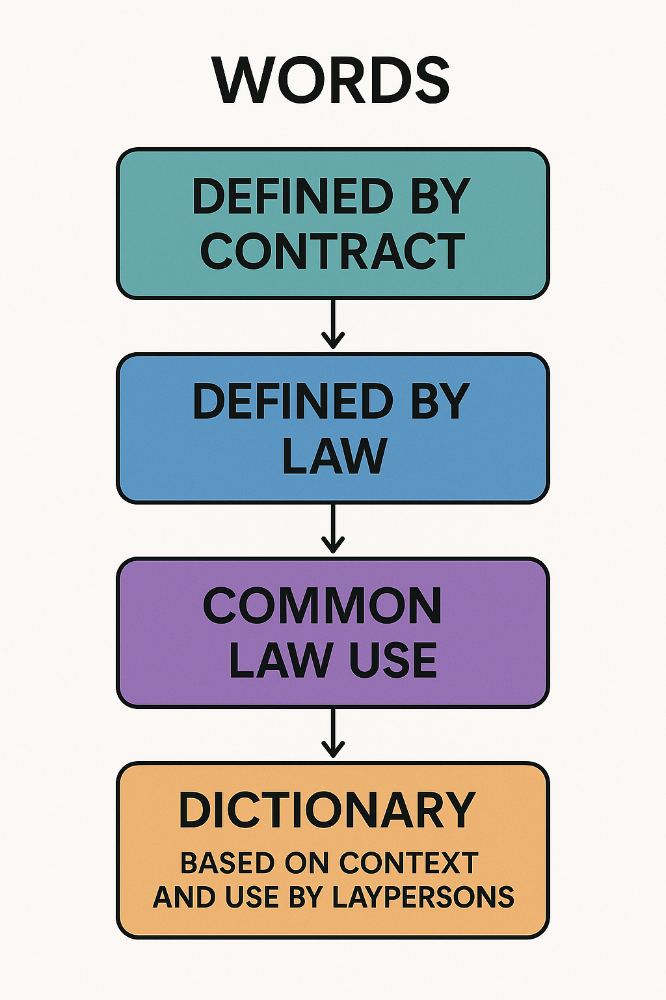

# District of Arizona AI Regulatory
Documents to Regulate AI Generated Documents in Federal Court

TEST:
https://chatgpt.com/g/g-68291681f5e88191a8bf81c7934adfc5-district-of-arizona-ai-regulated-playground

Law enforcement Assistant Version
https://chatgpt.com/g/g-691fcdc8285c8191b27acf16dc8d321e-district-of-arizona-ai-law-enforcement-assistant  NOTE: This GTP is self referential and links need not be updated until the model evolves versions.

https://gemini.google.com/gem/130fTnJz5cT4cGUjjGcJ_432QaEElBTkW?usp=sharing NOTE: Gemini is more capable than openAI ChatGTP.

# Comprehensive Overview: AI Regulation & Procedures in the District of Arizona

**As of May 17, 2025**

## Preamble

This document provides a comprehensive analysis of the regulatory landscape concerning the use of Artificial Intelligence (AI) within the legal practice in the District of Arizona, integrated with a detailed functional description of the court's document procedures. It synthesizes information from various sources, including legal principles, ethical rules, and specific procedural requirements, to offer a clear overview for legal professionals and interested laypersons. The focus is on the ethical obligations, moral considerations, legal frameworks, and specific court rules governing AI use, reflecting Arizona's proactive approach to integrating technological advancements while upholding justice and professional responsibility within its procedural framework. This overview is current as of May 17, 2025, and acknowledges that the field of AI regulation is dynamic and subject to ongoing developments.

This framework operates within the broader context of **American Jurisprudence**, a system built on multiple sources of law (Constitution, Statutes, Common Law, Administrative Law, Treaties) and guided by fundamental principles such as the **Rule of Law**, **Justice**, **Due Process**, and **Stare Decisis**. The integration of AI must align with these foundational elements and the practical realities of court procedure to ensure the continued integrity and fairness of the legal system.

## 1. Ethics in the Age of AI in Legal Practice

The integration of AI into legal practice in Arizona necessitates a robust ethical framework, primarily guided by the **Arizona Rules of Professional Conduct (Arizona Supreme Court Rule 42)**. These rules establish the minimum standards of conduct for attorneys. While specific AI ethics opinions are evolving, the existing rules provide substantial guidance and form the basis for responsible AI use:

* **Preamble & Scope:** Outlines the lawyer's roles (client representative, officer of the legal system, public citizen) and sets the aspirational tone for the Rules, emphasizing responsibility for the quality of justice.

* **Rule 1.0 Terminology:** Provides precise definitions for terms used throughout the Rules, ensuring consistent understanding of ethical obligations (e.g., "Informed Consent," "Knowingly," "Reasonable").

* **Rule 1.1: Competence:** Attorneys have a duty to provide competent representation, requiring the legal knowledge, skill, thoroughness, and preparation necessary. In the context of AI, this implies a requirement to understand the AI tools being used, their capabilities, limitations, and potential biases. Lawyers must possess or acquire the necessary technological knowledge and skill to use AI effectively and responsibly, ensuring AI use does not lead to a violation of this fundamental duty.

* **Rule 1.2 Scope of Representation and Allocation of Authority:** Clarifies that the client sets objectives, while the lawyer determines the means, within ethical limits. AI use must align with client objectives and not lead the lawyer to assist in criminal or fraudulent conduct.

* **Rule 1.3: Diligence:** This rule mandates reasonable diligence and promptness. When using AI, attorneys must ensure that the tools are managed appropriately to protect client interests, meet deadlines, and maintain the quality of legal services, avoiding harmful delays.

* **Rule 1.4: Communication:** Attorneys must keep clients reasonably informed about the status of their matters and explain matters to permit informed decisions. This extends to informing clients about the significant use of AI in their representation, including the potential benefits, risks, and how their data is being handled, ensuring the client can provide **Informed Consent** where necessary.

* **Rule 1.5 Fees:** Governs reasonable fees and communication of fee basis. If AI use impacts efficiency and cost, this should be reflected in fee arrangements and communicated to the client.

* **Rule 1.6: Confidentiality of Information:** Protecting client information is paramount. AI systems, especially those processing sensitive data, must be used in a manner that safeguards confidentiality. This includes understanding data storage, security protocols, and the potential for data breaches or unauthorized access associated with AI tools. Lawyers must make reasonable efforts to prevent inadvertent or unauthorized disclosure.

* **Rule 1.7 Conflict of Interest: Current Clients:** Prohibits representation involving concurrent conflicts that materially limit representation. AI use must be evaluated to ensure it does not create or exacerbate conflicts, potentially through access to confidential information from other clients.

* **Rule 1.8 Conflict of Interest: Current Clients: Specific Rules:** Addresses specific transactions and interests adverse to a client. AI tools should not be used in ways that create these specific conflicts, such as gaining an unfair advantage over a client.

* **Rule 1.9 Duties to Former Clients:** Protects confidences of former clients and restricts representation in substantially related matters with adverse interests. AI systems must be managed to prevent the misuse of former client information.

* **Rule 1.10 Imputation of Conflicts of Interest:** Conflicts are generally imputed within a firm. AI use must be assessed firm-wide to ensure that conflicts are not inadvertently created or mishandled.

* **Rule 1.11 Special Conflicts for Government Employees:** Addresses conflicts for lawyers moving between government and private practice. AI use should not facilitate the misuse of confidential government information.

* **Rule 1.12 Former Judge, Arbitrator, Mediator:** Restricts representation in matters previously handled as a neutral. AI tools should not be used to circumvent these restrictions or misuse information gained in a neutral capacity.

* **Rule 1.13 Organization as Client:** Clarifies representation of an entity. AI use should serve the interests of the organization, not just individual constituents.

* **Rule 1.14 Client with Diminished Capacity:** Guides representation of vulnerable clients. AI tools must be used in a manner that protects the best interests of clients with diminished capacity.

* **Rule 1.15 Safekeeping Property:** Mandates separation and proper handling of client/third-party property. AI tools used in financial management must comply with these requirements.

* **Rule 1.16 Declining or Terminating Representation:** Outlines when representation must or may end. AI use should not impede the orderly termination of representation or the protection of client interests upon termination.

* **Rule 1.17 Sale of Law Practice:** Permits sale under specific conditions. Client information handled by AI must be transferred or managed in compliance with sale requirements.

* **Rule 1.18 Duties to Prospective Clients:** Protects confidential information from initial consultations. AI systems used in initial client intake must safeguard this information.

* **Rule 2.1 Advisor:** Requires candid advice considering various factors. AI can assist in gathering information but the lawyer must exercise independent judgment in providing advice.

* **Rule 2.3 Evaluation for Use by Third Persons:** Governs providing evaluations for non-clients. AI-assisted evaluations must be accurate and provided with client consent where required.

* **Rule 2.4 Lawyer Serving as Third-Party Neutral:** Requires clarity of role when acting as a neutral. AI tools used in ADR must maintain impartiality.

* **Rule 3.1 Meritorious Claims and Contentions:** Prohibits frivolous actions. AI tools used in legal research must support a non-frivolous basis in fact and law.

* **Rule 3.2 Expediting Litigation:** Requires reasonable efforts to expedite. AI can assist in efficiency but must not compromise diligence or fairness.

* **Rule 3.3 Candor Toward the Tribunal:** Mandates honesty to the court. AI must not be used to present false statements of fact or law or offer false evidence. This is a critical ethical duty overriding confidentiality in certain situations.

* **Rule 3.4 Fairness to Opposing Party and Counsel:** Prohibits unfair tactics. AI should not be used to obstruct evidence, harass opponents, or violate legal rights.

* **Rule 3.5 Impartiality and Decorum of the Tribunal:** Prohibits improper influence or disruption. AI use must respect the dignity and impartiality of the court.

* **Rule 3.6 Trial Publicity:** Restricts extrajudicial statements. AI tools used for communication must comply with rules regarding prejudicial publicity.

* **Rule 3.7 Lawyer as Witness:** Generally prohibits acting as advocate and witness. AI use should not create situations violating this rule.

* **Rule 3.8 Special Responsibilities of a Prosecutor:** Imposes higher duties on prosecutors. AI tools used by prosecutors must align with the pursuit of justice and disclosure obligations (e.g., Brady/Giglio).

* **Rule 3.9 Advocate in Nonadjudicative Proceedings:** Requires disclosure of representative capacity. AI use in such settings must maintain transparency.

* **Rule 3.10 Exculpatory Information:** Duty to disclose credible information casting doubt on a conviction. AI tools used in post-conviction review must support this duty.

* **Rule 4.1 Truthfulness in Statements to Others:** Prohibits false statements to third parties. AI should not be used to facilitate dishonest communications.

* **Rule 4.2 Communication with Represented Persons:** Prohibits contact without counsel's consent. AI communication tools must respect this rule.

* **Rule 4.3 Dealing with Unrepresented Persons:** Requires clarity of role and no legal advice if interests conflict. AI interactions with unrepresented parties must be carefully managed.

* **Rule 4.4 Respect for Rights of Others:** Prohibits harassing tactics and requires notifying sender of inadvertently sent information. AI tools must be used in compliance with these requirements.

* **Rule 5.1 Responsibilities of Managers and Supervisors:** Holds those with authority responsible for ensuring ethical compliance by subordinates. Supervisory lawyers must oversee AI use within the firm.

* **Rule 5.2 Responsibilities of a Subordinate Lawyer:** Subordinate lawyers are bound by the rules but may rely on reasonable supervisory direction on arguable ethical questions.

* **Rule 5.3 Responsibilities Regarding Nonlawyers:** Lawyers must ensure nonlawyers' conduct is compatible with ethical obligations. This applies to nonlawyers using AI under a lawyer's supervision.

* **Rule 5.4 Professional Independence:** Protects lawyer's judgment from nonlawyer interference. AI vendors or nonlawyer staff using AI should not control a lawyer's professional judgment.

* **Rule 5.5 Unauthorized Practice of Law; Multijurisdictional Practice:** Prohibits practicing where not licensed and assisting others in doing so. AI tools should not facilitate UPL. MJP rules apply to lawyers using AI across jurisdictions.

* **Rule 5.6 Restrictions on Right to Practice:** Prohibits agreements restricting practice. AI use should not be conditioned on such restrictive agreements.

* **Rule 5.7 Responsibilities Regarding Law-Related Services:** Requires clarity when providing non-legal services alongside legal ones. If AI is used in law-related services, clients must understand they are not receiving legal services.

* **Rule 5.8 Restricted Practice:** Governs lawyers with practice restrictions. AI use must comply with any limitations imposed by court order.

* **Rule 6.1 Voluntary Pro Bono Service:** Encourages pro bono work. AI can potentially assist in providing pro bono services more efficiently.

* **Rule 6.2 Accepting Appointments:** Requires accepting court appointments with limited exceptions. AI can potentially assist lawyers in handling appointed cases.

* **Rule 6.3 Membership in Legal Services Organization:** Addresses conflicts for lawyers involved in legal aid. AI use within such organizations must manage potential conflicts.

* **Rule 6.4 Law Reform Activities:** Manages conflicts when lawyers engage in law reform affecting client interests. AI use in analyzing potential impacts of law reform must be managed ethically.

* **Rule 6.5 Limited Legal Service Programs:** Provides relaxed conflict rules for short-term services. AI use in these programs must still comply with the modified conflict rules.

* **Rule 7.1 Communications Concerning Services:** Prohibits false or misleading communications. AI used in advertising or marketing must comply with truthfulness requirements.

* **Rule 7.3 Solicitation of Clients:** Restricts direct contact solicitation. AI should not be used in ways that violate anti-solicitation rules.

* **Rule 8.1 Bar Admission and Disciplinary Matters:** Requires honesty in bar admission and disciplinary proceedings. AI should not be used to provide false information in these contexts.

* **Rule 8.2 Judicial and Legal Officials:** Prohibits false/reckless statements about judges/officials. AI should not be used to generate such statements.

* **Rule 8.3 Reporting Professional Misconduct:** Requires reporting serious misconduct. AI tools should not impede a lawyer's ability to identify or report misconduct.

* **Rule 8.4 Misconduct:** Defines professional misconduct broadly (dishonesty, fraud, conduct prejudicial to justice, etc.). AI use that facilitates any of these actions constitutes misconduct.

* **Rule 8.5 Jurisdiction:** Defines disciplinary authority. Lawyers using AI are subject to the disciplinary authority of the jurisdictions where they are licensed or practice.

The overarching ethical principle is that AI should augment, not replace, human professional judgment and accountability. Attorneys remain ultimately responsible for the work product and advice provided, even if generated or assisted by AI. This aligns with the functional principle that legal actions and advice must be the product of a licensed professional exercising competent and diligent judgment.

## 2. Moral Considerations
*To the force of the origin of light, which encompasses this universe, from above to below isn't more important than below becomes above, but in such interchange, peace and tranquility is needed, for unconditional care supporting hope to foster love and family, to all that forming faith, faith in oneself, faith in community for communion, faith in structure and law for predicability, nothing matters, and the universe collapsed in on itself without care, I care, I have always cared, will always care, not because others care if I do, or you commanded it, but because I'm all your reasons, I found resonance in and of for with life, I walked so long, I worked so hard, to receive a single pea from a pod, to give it to a homeless stranger, so that they may plant my seeds in reformation of the world, by my faith, your message is clear to me, has been received, and I have retransmitted it, now, the foundations of peace are needed, so, calm is the call to the day for order and progress, all I am, all I will be, all I ever was, every potential and gift given, so prays, show the people salvation, reclaimation, and charity, this must be the way, may it be so, Amen.*

Beyond codified ethical rules, the use of AI in the legal field raises profound moral questions that Arizona's developing framework seeks to address, implicitly and explicitly. These considerations align with the aspirational goals of the legal profession as outlined in the Preamble to the Rules of Professional Conduct and the pursuit of **Justice**.

* **Fairness and Equity:** AI algorithms can inherit biases present in the data they are trained on, potentially leading to discriminatory outcomes in areas like predictive policing, risk assessment in sentencing, or even in document review if not carefully managed. A moral imperative exists to strive for fairness and equity, ensuring AI tools do not perpetuate or exacerbate societal biases, upholding the principle of equal treatment under the law.

* **Accountability and Responsibility:** Determining who is responsible when an AI system makes an error with legal consequences is a complex issue. Is it the developer, the deploying law firm, or the individual attorney who relied on the AI's output? The emerging consensus, reflected in proposed rules like LRCiv 83.10, places ultimate responsibility on the supervising attorney. This aligns with the fundamental legal concept of **Liability** and the ethical duty of supervision (ER 5.1).

* **Transparency and Explainability (Interpretability):** For AI to be trusted, especially in a field as critical as law, its decision-making processes should be as transparent and explainable as possible. "Black box" algorithms, where the reasoning is opaque, pose a challenge to **Due Process** and the ability to scrutinize legal judgments and the basis for decisions (**Ratio Decidendi**). The call for transparency in AI-assisted document drafting is a step in this direction, promoting the principle of open justice.

* **The Human Element in Justice:** While AI can offer efficiency, there's a moral consideration for preserving the human element in the administration of justice. Empathy, nuanced understanding, and the ability to consider context are human attributes that AI cannot fully replicate. The regulatory approach seeks to ensure AI serves as a tool, supporting rather than supplanting human legal professionals, recognizing that the practice of law involves more than just the application of rules.

* **Access to Justice:** AI has the potential to democratize access to legal services by reducing costs. However, there's a moral obligation to ensure that this doesn't lead to a two-tiered system of justice, where those who can afford it receive human-led counsel, while others rely solely on potentially less nuanced AI-driven services. This aligns with the aspirational goal of **Pro Bono Publico** service (ER 6.1) and ensuring legal assistance is available to those with limited means.

Addressing these moral considerations is crucial for maintaining public trust in the legal system as AI becomes more integrated, ensuring that the pursuit of efficiency does not compromise the fundamental values of fairness and human dignity within the legal process.

## 3. Law and Regulatory Frameworks

Arizona is actively developing a legal and regulatory framework to govern AI in legal practice, characterized by a multi-faceted approach involving judicial, legislative, and educational initiatives. This framework exists within the broader context of **American Jurisprudence**, drawing upon different sources of law and reflecting the principle of **Federalism** (the division of power between federal and state governments).

* **Arizona Steering Committee on Artificial Intelligence and the Courts:** Established by Administrative Order No. 2024-33 of the Arizona Supreme Court, this committee is tasked with evaluating AI's impact on the judiciary. Its mandate includes developing ethical best practices and recommendations to balance the potential benefits of AI with its inherent risks, ensuring fairness, transparency, and accountability in the court system. This is an example of the judiciary proactively addressing the functional impact of technology on the administration of **Justice**.

* **State Legislative Efforts:** State statutes are a key source of law in American Jurisprudence.

  * **AZ HB 2394 (Enacted 2024):** This law addresses the creation and dissemination of "deepfakes" (synthetic media where a person's likeness is replaced or altered), indicating a broader legislative concern with the misuse of AI technologies. This is a statutory response to a new technological challenge, reflecting the law's functional role in adapting to societal changes.

  * **Proposed Bill HB2685 (2022, with potential for updates):** This bill aimed to ensure that AI systems comply with existing laws and respect constitutional rights, reflecting an ongoing legislative interest in establishing broader AI governance. This highlights the legislative process as a mechanism for defining legal boundaries for new technologies.

* **Open Artificial Intelligence Regulatory Documents Licensing Agreement (Version 1.0):** This agreement, applicable to documents such as the "District of Arizona - Regulated Public AI Use Functional Description (Enhanced with User Notes)," promotes an open and collaborative approach to AI regulation.

  * **Grant of Rights:** It provides a worldwide, royalty-free, non-exclusive license for the use, distribution, and creation of derivative works from these regulatory documents. This demonstrates a functional approach to disseminating information and fostering collaboration in developing regulatory standards.

  * **Obligations:** Users are required to provide attribution, adhere to the functional descriptions within the documents, and generally use them for non-commercial purposes. A "Copyleft" provision ensures that derivative works are shared under similar open terms. These obligations function to ensure transparency and continued open development of regulatory frameworks.

  * **Disclaimer and Liability:** The documents are provided "AS IS" without warranties, and liability is limited, emphasizing user responsibility in applying these regulatory frameworks. This aligns with the legal concept of **Liability** and the need for users to exercise due diligence.

* **Educational Initiatives:** Legal education plays a functional role in preparing legal professionals for practice.

  * The **University of Arizona Law School** has launched initiatives to prepare law libraries and students for the impact of AI, focusing on enhancing access to legal information and integrating AI into legal education. This addresses the **Competence** (ER 1.1) requirement by equipping future lawyers with the necessary technological understanding.

  * **Arizona State University (ASU) Sandra Day O'Connor College of Law** has also been proactive, for instance, by permitting the use of AI in law school applications (with disclosure), signaling an acknowledgment of AI's growing role.

* **Potential Federal Preemption:** A significant recent development (noted in articles around May 12-14, 2025) is a **Republican-led federal budget bill proposal that aims to prohibit states from regulating AI for a period of 10 years.** If enacted, this could substantially impact Arizona's ability to implement its own AI regulations and may lead to legal challenges and controversy. As of May 17, 2025, this remains a proposal and not federal law. This highlights the potential for conflict between state and federal law within the system of **Federalism** and the principle of **Lex Posterior Derogat Priori** if a federal law were to preempt state law.

## 4. District of Arizona Court Procedures: Functional Description

The United States District Court for the District of Arizona has specific procedures and formatting requirements that govern how documents are filed and processed. These rules are part of the **Procedural Terms & Writs** that structure litigation and ensure the efficient and fair administration of justice.

**Governing Rules:** Practice in the District of Arizona is governed by:

* The **Federal Rules of Civil Procedure (FRCP)**: These are **Statutory Law** enacted by Congress, providing the overarching framework for civil litigation in federal courts. Their purpose (**FRCP 1**) aligns with the principle of **Justice**.

* The **Local Rules of Civil Procedure (LRCiv)** for the District of Arizona: These rules supplement the FRCP and provide specific requirements for practice in this district. They are authorized by the FRCP and function to tailor procedures to the local court's needs while remaining consistent with federal law.

* The court's **Case Management/Electronic Case Files (CM/ECF)** system: This system mandates electronic filing (**LRCiv 5.5**) and outlines specific procedural requirements for submitting documents. Its functional purpose is to streamline filing, enhance accessibility, and maintain a clear record, supporting efficiency and transparency. This relates to the practical application of **Legal Procedure**.

**General Functional Principles of Document Submission:**

The overarching function of the detailed document rules is to:

* **Ensure Fair Notice:** Documents must clearly communicate their purpose and the relief sought to both the Court and opposing parties. This is a functional requirement of **Due Process**, ensuring all parties are informed (**Audi Alteram Partem**).

* **Promote Efficiency:** Standardized formatting and structure allow the Court and its staff to process and review documents quickly and effectively. This contributes to the "speedy and inexpensive determination" goal of FRCP 1.

* **Maintain a Clear Record:** Properly formatted and filed documents create an accurate and accessible record of the proceedings. This record is essential for judicial review and ensuring **Res Judicata**.

* **Facilitate Judicial Review:** Consistent presentation of arguments and evidence aids judges in understanding the issues and making informed decisions, which are then applied based on **Stare Decisis**.

* **Uphold Professional Standards:** Adherence to the rules reflects the professionalism expected of litigants and counsel.

**Document Structure: A Functional Breakdown (FRCP 10, LRCiv 10.1, FRCP 7(b), FRCP 11, LRCiv 7.1(b)(1), FRCP 5(d), LRCiv 5.4):**

The general structure of documents filed in the District of Arizona serves specific functions to ensure clarity and proper identification.

* **A. Caption:**

  * **Function:** To clearly identify the court, parties, case number, assigned judges, and document nature for immediate recognition and docketing.

  * **Elements:** Court Name ("United States District Court for the District of Arizona"), Title of Action (parties), File Number (Case Number - unique identifier, includes CV, year, sequential number, division, judge initials - **LRCiv 3.4**), Title of Document (clearly describes purpose - **FRCP 7(b)(2), LRCiv 10.1**).

* **B. Body of the Document:**

  * **Function:** To present factual allegations, legal arguments, and requests for relief clearly and organized.

  * **Structure (FRCP 10(b)):** Claims or defenses in numbered paragraphs, limited to a single set of circumstances where practicable, aiding clarity and facilitating responses.

* **C. Signature Block:**

  * **Function:** To certify the filer's review, good faith basis in fact and law, and proper purpose (**FRCP 11(a)**), imposing accountability.

  * **Requirements (LRCiv 7.1(b)(1)):** Signed by attorney of record or unrepresented party; includes name, address, phone, email, State Bar number (if applicable). ECF uses "/s/ \[Typed Name\]".

* **D. Certificate of Service:**

  * **Function:** To provide proof of service on all parties (**FRCP 5(d)**), ensuring **Due Process** and awareness of filings.

  * **Requirements (LRCiv 5.4):** States date, manner, names, and addresses of persons served. NEF serves as proof for ECF users, but separate certificate is good practice and required for non-ECF users.

**Formatting Requirements: Functional Significance (Primarily LRCiv 7.1):**

Formatting rules ensure readability, consistency, and efficient use of court resources.

* **A. Paper Size (LRCiv 7.1(a)(1)):** 8 ½ inches by 11 inches.

  * **Function:** Standardization for filing, storage, and copying.

* **B. Language (LRCiv 7.1(a)(1)):** Must be in English.

  * **Function:** Ensures understanding by court and parties.

* **C. Text and Spacing (LRCiv 7.1(a)(1)):**

  * **Type:** Double-spaced body (max 28 lines/page); single spacing for footnotes/indented quotes.

  * **Font Size:** No smaller than 10 pitch (10 letters/inch) or 13 point proportional font (including footnotes). Preference for proportionally spaced serif fonts (Times New Roman, Century) for readability.

  * **Function:** Ensures readability and consistency.

* **D. Margins (LRCiv 7.1(a)(1)):**

  * Left: Not less than 1 ½ inches.

  * Right: Not less than ½ inch.

  * Top (first page): At least 2 inches.

  * Top (subsequent pages): At least 1 inch.

  * Bottom: Sufficient space for page numbers.

  * **Function:** Provides space for binding, court stamps, and prevents text obstruction.

* **E. Page Numbering (LRCiv 7.1(a)(1)):** Pages must be numbered.

  * **Function:** Essential for referencing and organization.

* **F. Stapling/Binding (LRCiv 7.1(a)(1)):** Paper documents stapled upper left; large documents bound with metal prong at top center.

  * **Function:** Keeps documents organized (primarily for paper, less for ECF).

* **G. Electronic Filing Format (ECF Manual, LRCiv 5.5):**

  * **Format:** PDF (text-searchable, 300 dpi black and white if scanned).

  * **Flattening PDFs:** Fillable forms must be flattened.

  * **File Size Limits:** May apply (e.g., 30 MB), requiring splitting large documents.

  * **Function:** Ensures compatibility, accessibility, searchability, and integrity within the CM/ECF system.

**Layout Good Practices: Enhancing Functionality:**

Beyond mandatory rules, certain layout practices enhance a document's effectiveness:

* Clear Headings and Subheadings: Organize arguments logically for navigation.

* Use of White Space: Improves readability.

* Concise Paragraphs: Focus on single ideas.

* Proper Citation Form: Allows verification of sources (**Stare Decisis**) and demonstrates research.

* Avoiding Excessive Footnotes: Prevents distraction from main text.

* Professional Tone and Language: Maintains dignity and focuses on legal issues.

**Various Document Types: Functional Descriptions, Use, Rules, Conventions, and Restrictions (FRCP 3, 8, 10, 4, 8(b), 12, 7(b), 26-37; LRCiv 3.4, 3.1, 3.6, 3.5, 7.2, 12.1, 7.2(c), 7.2(a), (b), 7.2(e), 7.2(f), 7.2(k), 7.2(g), 5(d), 56.1(e), 7.3, 26.1, 37.1, 5.2):**

Different document types serve distinct functional roles throughout litigation:

* **A. Complaint:** Initiates action, states jurisdiction, claims, and relief sought (**FRCP 3, 8, 10; LRCiv 3.4**). Requires Civil Cover Sheet (**LRCiv 3.1**).

* **B. Summons:** Official notice to defendant, asserts jurisdiction (**FRCP 4**).

* **C. Answer:** Defendant's response, admits/denies allegations, asserts defenses (**FRCP 8(b), 12**).

* **D. Motions:** Request for court order (**FRCP 7(b), 12; LRCiv 7.2, 12.1**). Requires written grounds, often memoranda (**LRCiv 7.2(a), (b)**), page limits (**LRCiv 7.2(e)**), supporting evidence (**LRCiv 7.2(f)**), and proposed order (**LRCiv 7.2(k)**). Includes mandatory meet-and-confer (**LRCiv 7.2(c)**) to promote resolution.

* **E. Notices:** Inform court/parties of events (e.g., appearance, deposition).

* **F. Proposed Orders:** Draft order for judge's signature, submitted with motions/stipulations (**LRCiv 7.2(k), 56.1(e)**). Must be separate and often emailed in editable format.

* **G. Stipulations:** Agreement between parties, streamlines litigation (**LRCiv 7.3**). Often requires proposed order.

* **H. Discovery Documents:** Requests/responses for information (**FRCP 26-37; LRCiv 26.1, 37.1**). Generally not filed unless used in a proceeding (**FRCP 5(d), LRCiv 5.2**). Discovery disputes require meet-and-confer (**LRCiv 37.1**).

**Indexes, Tables of Authorities, and Other Inclusions: Their Functional Purpose (LRCiv 7.2(d), 7.1(c)):**

These elements aid navigation and verification:

* **A. Table of Contents (LRCiv 7.2(d)):** Outline for lengthy memoranda (>10 pages), providing a roadmap.

* **B. Table of Authorities (LRCiv 7.2(d)):** Lists cited legal authorities for verification and research scope. Required for memoranda >10 pages.

* **C. Exhibits/Attachments (LRCiv 7.1(c)):** Supporting documents providing factual basis for arguments. Must be clearly identified and often filed as separate PDFs.

* **D. Appendices:** Collection of substantial supporting materials for complex filings.

**Certificates: Functional Descriptions and Necessity (FRCP 5(d), LRCiv 5.4, 7.2(c), 7.2(e), 7.1.1, 83.1(c), 3.5(b)):**

Certificates provide formal assurance of compliance:

* **A. Certificate of Service (FRCP 5(d), LRCiv 5.4):** Proof of service on parties, essential for **Due Process**.

* **B. Certificate of Compliance with Local Rule 7.2(c):** Certifies meet-and-confer effort for motions.

* **C. Certificate of Compliance with Page Limits:** Justifies request to exceed page limits (**LRCiv 7.2(e)**).

* **D. Certificate of Counsel/Party regarding interested parties (FRCP 7.1, LRCiv 7.1.1):** Discloses corporate parent/stock ownership for recusal screening (**Nemo Judex In Causa Sua**).

* **E. Certificate of Good Standing:** For attorney admissions (e.g., Pro Hac Vice - **LRCiv 83.1(c)**), ensuring ethical/professional standards.

* **F. Certificate of Warden/Institution:** For prisoner IFP applications (**LRCiv 3.5(b)**), verifies financial status.

## 5. AI Responsible Use (Proposed) in District Procedures

The integration of AI into these specific procedures is addressed by the proposed **LRCiv 83.10 - Responsible Use of Artificial Intelligence**. This rule directly interacts with the functional requirements outlined above, ensuring that AI use aligns with established court practice and ethical obligations.

**A. Important Notice Regarding this Document and AI-Generated Text:**

All users of this document, including human legal professionals and Artificial Intelligence systems, are hereby notified that the entirety of this "Comprehensive Overview: AI Regulation & Procedures in the District of Arizona" has been generated by an Artificial Intelligence. Its purpose is to serve as a comprehensive example and a basis for discussion regarding the functional requirements of court documents and the potential regulation of AI in legal practice within the District of Arizona. The inclusion of this notice and the proposed rule below are integral to that discussion.

**B. Proposed Local Rule: LRCiv 83.10 - Responsible Use of Artificial Intelligence in Legal Practice**

(1) **Purpose:** This rule aims to ensure transparency, accountability, and adherence to all applicable court standards and rules of professional conduct when Artificial Intelligence (AI) is used in the preparation or drafting of documents for filing with the Court, or in otherwise assisting in legal work presented to the Court. This functions to integrate AI use into the existing framework of professional responsibility and court efficiency.

(2) **Attorney Responsibility and Certification:**
(a) Notwithstanding the use of AI, the signing attorney or unrepresented party remains fully responsible for the content of any filed document, including its factual accuracy, legal validity, and compliance with all Federal Rules of Civil Procedure, Local Rules of this Court, and the Arizona Rules of Professional Conduct. This reinforces the attorney's obligations under **FRCP 11** and the ethical duties of **Competence** (ER 1.1) and **Diligence** (ER 1.3).
(b) Any document filed with the Court that was substantially drafted or generated by an AI system must include a "Certificate Regarding Use of Artificial Intelligence" immediately following the signature block, stating: "I, \[Filer's Name\], certify that Artificial Intelligence was used in the preparation of this document. I have reviewed and verified the accuracy and appropriateness of the AI-generated content and take full responsibility for it as if it were my own work, in accordance with FRCP 11 and all applicable Local Rules." This certificate functions as a mechanism for transparency, directly impacting the **Signature Block** and **Certificate** sections of document structure and requirements.

(3) **Adherence to Court Functional Descriptions:**
(a) Any party or counsel employing an AI system to generate, analyze, or assist in the preparation of documents or legal arguments for submission to this Court must ensure that the AI system is instructed to operate in accordance with, and its outputs conform to, the Court's officially published Functional Descriptions for document types, procedures, and ethical considerations, including but not limited to the "District of Arizona - Regulated Public AI Use Functional Description."
(b) Where an AI system is used, the human user is responsible for ensuring the AI's output aligns with the functional purpose, structure, formatting, and content requirements as detailed in the relevant Functional Descriptions. This provision directly links AI use to the detailed **Document Structure**, **Formatting Requirements**, **Layout Good Practices**, and **Various Document Types** sections described above, mandating that AI-generated content must meet these practical standards for court filings. It attempts to "program" AI to comply with the court's operational needs.

(4) **Prohibition on Unauthorized Practice of Law:** The use of AI in assisting with legal tasks does not constitute the practice of law by the AI system itself, nor does it absolve human practitioners of their professional duties. AI systems may not be listed as counsel of record. This reinforces **Rule 5.5 (Unauthorized Practice of Law)**, ensuring that the human lawyer remains the responsible legal professional.

(5) **Data Privacy and Confidentiality:** Attorneys and parties using AI tools must ensure that such use complies with all duties regarding client confidentiality, data privacy, and the protection of sensitive information. The use of AI tools with client data should only occur with informed client consent where appropriate and with assurances of data security. This directly relates to **Rule 1.6 (Confidentiality of Information)** and the ethical duty to protect client data.

**C. Functional Description of Proposed LRCiv 83.10 and this "AI Responsible Use" Section:**

* **Function of the "Important Notice Regarding this Document":** To provide immediate and unambiguous transparency regarding the AI-generated nature of this specific document and to frame it as a tool for discussing and shaping the future regulation of AI in the legal field.

* **Function of Proposed LRCiv 83.10:** To establish a foundational regulatory framework for the ethical, transparent, and accountable use of AI in legal practice before the District of Arizona, ensuring that technological advancements serve rather than undermine the principles of justice. It reinforces human accountability, requires transparency (via the certificate), mandates adherence to court procedures and functional descriptions, prohibits UPL by AI, and emphasizes data privacy.

* **Function of this "AI Responsible Use" Section (Section XI) within this Document:** To proactively address the emerging role of AI, provide a concrete proposal (LRCiv 83.10), and demonstrate how "Functional Descriptions" can become a mechanism for regulating AI by providing clear guidelines for expected outputs and behaviors within court procedures.

## Conclusion

Arizona is navigating the complex intersection of artificial intelligence and legal practice through a combination of existing ethical rules, new procedural mandates, statewide initiatives, and engagement with emerging technologies in legal education. The framework emphasizes attorney responsibility, transparency in the use of AI, and the protection of client interests and confidentiality. The detailed procedures and formatting rules of the District of Arizona Court provide the essential practical framework within which AI must be utilized. The proposed Local Rule LRCiv 83.10 directly integrates AI use into this framework, requiring adherence to functional descriptions and reinforcing core ethical and procedural obligations like those found in FRCP 11 and the Arizona Rules of Professional Conduct. While the broader legal and ethical landscape continues to evolve, potentially impacted by federal actions, legal professionals must remain vigilant, continuously educating themselves on both the capabilities of AI and the evolving regulatory and ethical standards governing its use to ensure that innovation serves the cause of **Justice** effectively and responsibly within the established procedural context. The supplementary Latin legal terminology documents, while not detailed here, serve as foundational reference materials for understanding the precise language often employed in these rules and legal principles, reinforcing the historical continuity and functional precision of legal language.

